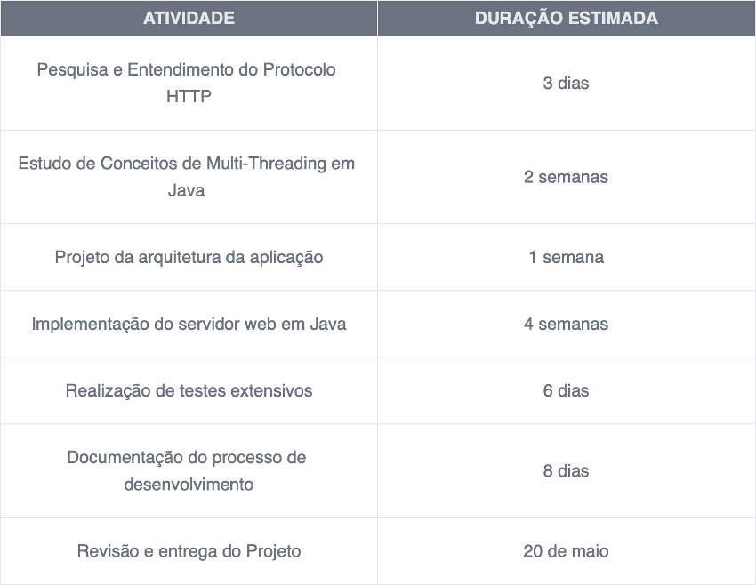

# Proposta de Projeto: Desenvolvimento de Servidor Web Multi-Threading em Java

# Tema: Multi-threading Application

## Docente: Pedro Rosa

### Grupo:

- Wesley Augusto - 20200344
- Kevin Dos Santos - 20210448
- Eularinani Ecombe - 20210329

## 1. Descrição do Problema e Motivação:

Com o advento da internet e o crescimento exponencial de usuários online, a demanda por aplicações web eficientes e escaláveis tornou-se uma necessidade premente. Os servidores web desempenham um papel fundamental nesse contexto, sendo responsáveis por receber, processar e responder às solicitações dos clientes de forma rápida e confiável. No entanto, conforme o número de usuários e solicitações aumenta, os servidores enfrentam desafios de desempenho e escalabilidade.

Um dos principais desafios é a capacidade de lidar com múltiplas solicitações de forma simultânea, garantindo uma experiência de usuário fluida e sem interrupções. Tradicionalmente, os servidores web utilizam uma abordagem baseada em threads para lidar com múltiplas solicitações concorrentes. No entanto, o gerenciamento eficiente dessas threads e a prevenção de condições de corrida e outros problemas de concorrência podem ser complexos e desafiadores.

Diante desse cenário, surge a necessidade de explorar técnicas avançadas de programação, como multi-threading, para desenvolver servidores web capazes de lidar com alta concorrência de forma eficiente e escalável. Este projeto visa abordar esse desafio, propondo o desenvolvimento de um servidor web simples, porém robusto, utilizando a linguagem de programação Java e explorando os conceitos de multi-threading para lidar com múltiplos clientes simultaneamente.

### Identificação de Casos de Uso:

1. Hospedagem de Sites: O servidor desenvolvido pode ser utilizado para hospedar uma variedade de sites, desde páginas estáticas até aplicações web dinâmicas, garantindo uma resposta rápida e confiável às solicitações dos usuários.

2. Aplicações Web com Alta Concorrência: Serviços online que requerem alta concorrência, como salas de bate-papo, fóruns ou jogos multiplayer, podem se beneficiar significativamente de um servidor capaz de lidar eficientemente com múltiplas conexões simultâneas.

3. Implementação de APIs e Serviços RESTful: O servidor desenvolvido pode ser utilizado para implementar serviços RESTful e APIs, permitindo a comunicação eficiente entre clientes e servidores em ambientes distribuídos.

## 2. Descrição da Solução a Implementar:

### Solução Genérica:

A proposta visa desenvolver um robusto servidor web multithreading em Java para atender às demandas crescentes por serviços web de alto desempenho. O servidor será projetado para lidar com múltiplas conexões HTTP de forma simultânea, utilizando um modelo multithreaded para processar cada solicitação de maneira independente e eficiente. Ao adotar essa abordagem, garantiremos uma distribuição eficaz dos recursos do servidor, proporcionando uma resposta rápida e confiável mesmo em situações de pico de tráfego.

Durante o desenvolvimento, a solução foi aprimorada com as seguintes alterações que diferem da proposta inicial:
• Containerização com Docker: O servidor web mulHthreading em Java foi encapsulado em containers Docker, facilitando a portabilidade, o isolamento e a gestão dos ambientes de execução.

• Implementação na AWS: UHlizamos a infraestrutura da AWS para hospedar os containers Docker, beneficiando-nos da escalabilidade e robustez da plataforma.

• Load Balancer: Um load balancer da AWS foi configurado para distribuir o tráfego de rede entre dois containers Docker, garanHndo alta disponibilidade e balanceamento de carga eficiente.

• Ambiente de Execução: Os containers Docker são executados em máquinas virtuais Linux na AWS, proporcionando um ambiente escalável e robusto para o servidor web.

• Arquivos aceites: Na primeira proposta, foi mencionado que o servidor trabalharia apenas com arquivos estáHcos do formato HTML, mas após algumas discussões com o docente houve a necessidade de adicionar mais alguns formatos aceites. Como CSS, JAVASCRIPT, imagem(.JPG)

• Validação de requests: A junção com a cadeira de compiladores, fez com que implementássemos esta funcionalidade. O servidor aceita apenas pedidos GET e POST. O que fez com que implementássemos a validação dos pedidos através da expressão regular "^(GET|POST)\\s(\\/\\S*)\\s(HTTP\\/\\d\\.\\d)$". Caso pedido não seja um GET ou POST a página retorna um Bad request (400 error).

Com essas melhorias, a solução desenvolvida se tornou mais robusta, escalável e eficiente, atendendo melhor às necessidades dos uHlizadores e garanHndo um desempenho excecional em diferentes condições de carga.
Enquadramento nas Áreas da Unidade Curricular:
Este projeto está alinhado com os objeHvos da disciplina ao explorar conceitos avançados de programação em Java e sua aplicação na construção de sistemas distribuídos e servidores web. Ao desenvolver um servidor web mulH-threaded em Java, os alunos terão a oportunidade de aprofundar seus conhecimentos em programação orientada a objetos, manipulação de threads e comunicação de rede.
Além disso, o projeto permite explorar conceitos teóricos, como protocolos de rede e protocolo HTTP, na práHca, contribuindo para uma compreensão mais abrangente dos fundamentos da computação distribuída e desenvolvimento de sistemas web.
Ao final do projeto, espera-se que os alunos estejam aptos a aplicar os conceitos e técnicas aprendidos em cenários do mundo real, enfrentando desafios comuns na implementação de servidores web e sistemas distribuídos.

### Enquadramento nas Áreas da Unidade Curricular:

Este projeto está alinhado com os objetivos da disciplina ao explorar conceitos avançados de programação em Java e sua aplicação na construção de sistemas distribuídos e servidores web. Ao desenvolver um servidor web multi-threaded em Java, os alunos terão a oportunidade de aprofundar seus conhecimentos em programação orientada a objetos, manipulação de threads e comunicação de rede.

Além disso, o projeto permite explorar conceitos teóricos, como protocolos de rede e protocolo HTTP, na prática, contribuindo para uma compreensão mais abrangente dos fundamentos da computação distribuída e desenvolvimento de sistemas web.

Ao final do projeto, espera-se que os alunos estejam aptos a aplicar os conceitos e técnicas aprendidos em cenários do mundo real, enfrentando desafios comuns na implementação de servidores web e sistemas distribuídos.

### Requisitos Técnicos:

1. Proficiência avançada em programação Java e sólido entendimento dos conceitos de programação orientada a objetos, incluindo herança, polimorfismo e encapsulamento.
2. Conhecimento sólido dos princípios fundamentais de redes, incluindo protocolos TCP/IP e HTTP, bem como familiaridade com conceitos como requisição, resposta e cabeçalhos HTTP.
3. Capacidade de utilizar eficazmente ambientes de desenvolvimento integrado (IDEs) para Java, como Eclipse, IntelliJ IDEA, para desenvolver, depurar e testar o servidor web.
4. Experiência prévia e compreensão profunda de programação multithreaded em Java, incluindo sincronização, monitoramento de condições e práticas recomendadas para evitar condições de corrida e deadlocks.
5. Capacidade de projetar e implementar estruturas de dados e algoritmos eficientes para manipular solicitações HTTP concorrentes, garantindo o desempenho, a escalabilidade e a segurança do servidor web.
6. Familiaridade com técnicas de otimização de código e depuração de problemas de desempenho em ambientes multithreading, para garantir uma execução suave e eficiente do servidor sob diferentes condições de carga.
7. Habilidade para documentar adequadamente o código-fonte, incluindo comentários claros e concisos, e seguir boas práticas de desenvolvimento de software, como modularidade, coesão e baixo acoplamento.
8. Conhecimento e experiência em utilizar ferramentas de teste de carga, como o Apache JMeter, para avaliar o desempenho, a escalabilidade e a confiabilidade do servidor web em condições simuladas de tráfego intenso.

### Arquitetura da Solução:

A arquitetura da solução será cuidadosamente projetada para garantir a eficiência e a confiabilidade do servidor web multithreading. No núcleo da arquitetura estará um servidor principal altamente escalável, capaz de gerenciar e coordenar conexões de clientes de forma eficiente.

Cada vez que uma conexão é estabelecida, o servidor principal dinamicamente cria uma nova thread dedicada para lidar com as solicitações desse cliente específico. Essa abordagem permite que o servidor atenda a múltiplas solicitações simultaneamente, sem sobrecarregar o sistema ou comprometer sua estabilidade.

Cada thread será responsável por gerenciar integralmente uma conexão individual, manipulando a entrada e saída de dados associados à solicitação HTTP correspondente. Isso significa que o servidor será capaz de processar solicitações de forma independente, distribuindo eficientemente a carga de trabalho entre as threads disponíveis.

Ao adotar essa arquitetura multithreading, estamos garantindo que o servidor seja altamente responsivo e capaz de lidar com uma ampla gama de cenários de uso, desde solicitações simples até cargas de tráfego intenso. Além disso, essa abordagem maximiza a utilização dos recursos do sistema, proporcionando uma resposta rápida e consistente às solicitações dos clientes.

### Tecnologias a Utilizar:

- Linguagem de programação Java para desenvolver o servidor web, utilizando bibliotecas como java.net para comunicação de rede.
- IDE para desenvolvimento Java, como IntelliJ IDEA, escolhida por sua eficiência e recursos avançados de desenvolvimento.
- Ferramentas de teste, incluindo JUnit para testes unitários e Apache JMeter para testes de carga, permitindo uma avaliação abrangente do desempenho e escalabilidade do servidor web em diferentes cenários de uso.

### Planeamento e Calendarização:

### Bibliografia:

- [Java Concurrency in Practice](https://leon-wtf.github.io/doc/java-concurrency-in-practice.pdf)
- [O'Reilly Head First Servlets and JSP](https://theswissbay.ch/pdf/Gentoomen Library/Programming/O%27Reilly Desining Series/O%27Reilly Head First Servlets and JSP.pdf)
- Documentação oficial do Java SE.
- Documentação oficial do protocolo HTTP
