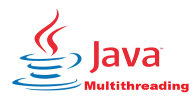
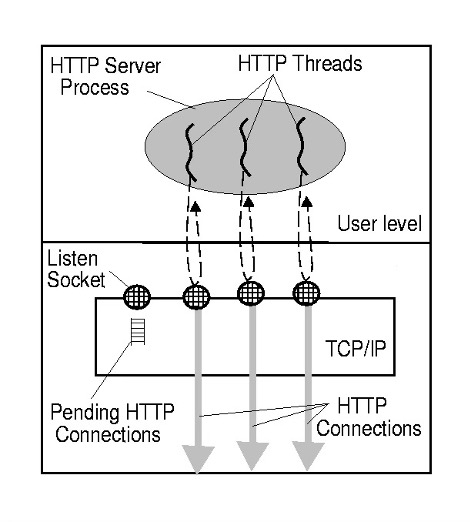
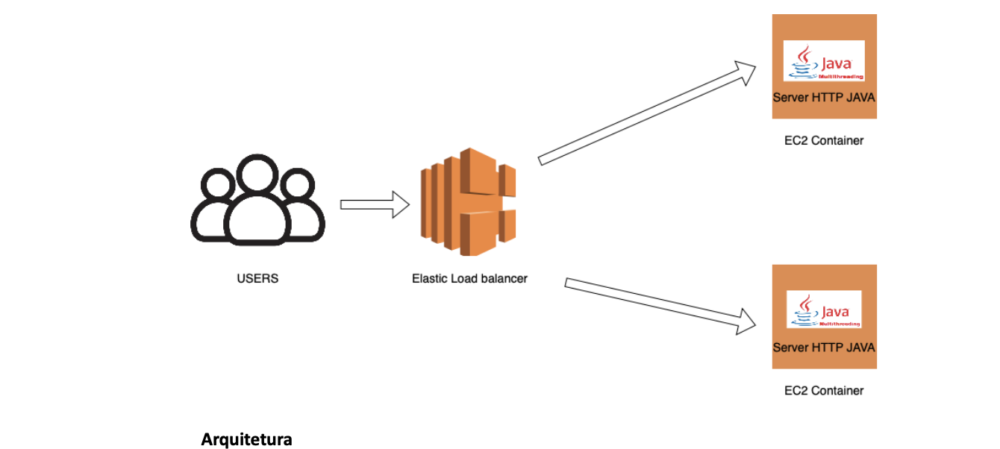
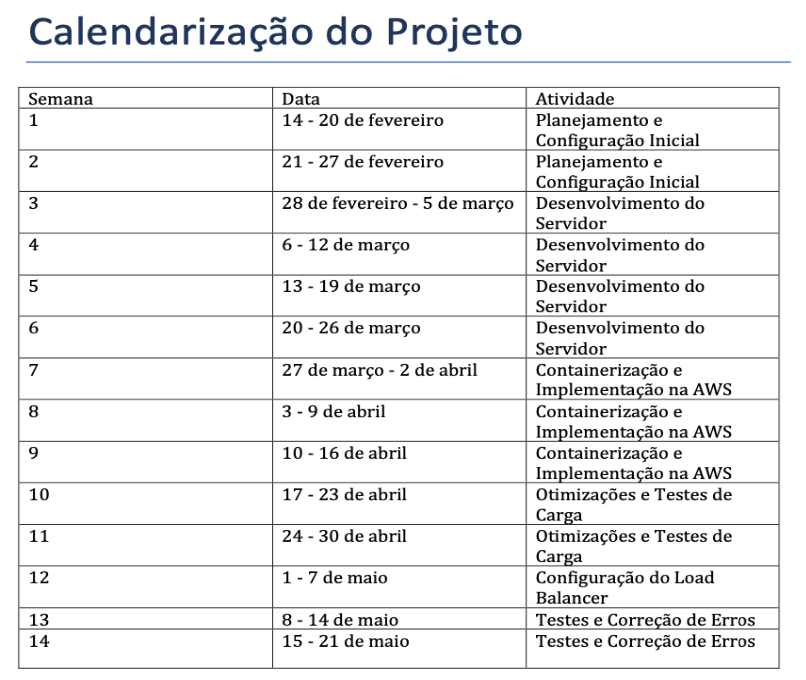
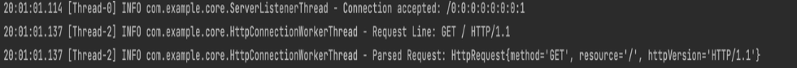
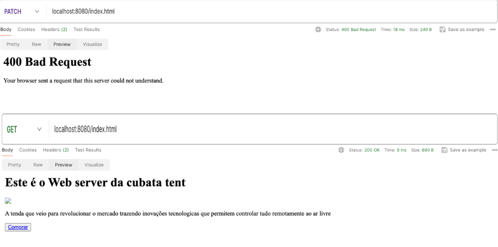
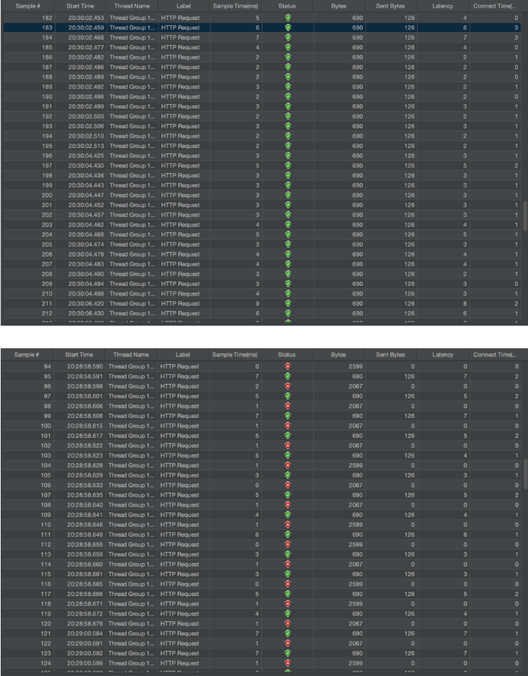
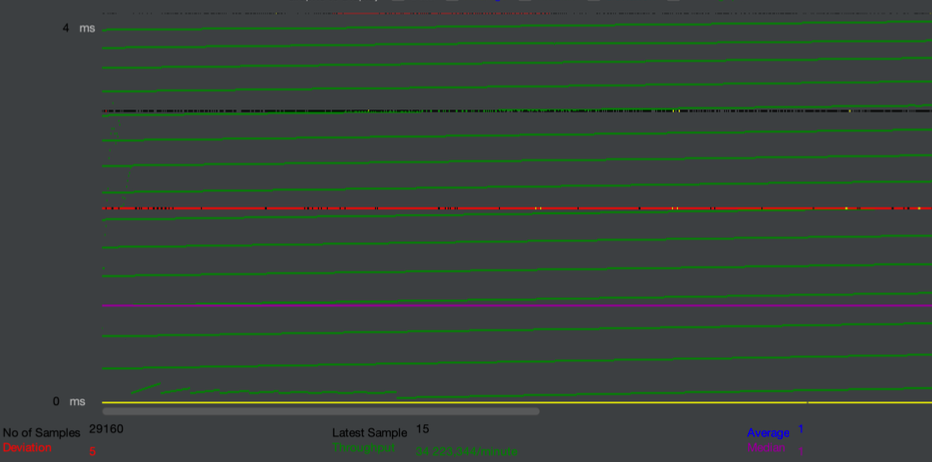

# Proposta de Projeto: Desenvolvimento de Servidor Web Multi-Threading em Java

# Tema: Multi-threading Application

## Docente: Pedro Rosa

### Grupo:

- Wesley Augusto - 20200344
- Kevin Dos Santos - 20210448
- Eularinani Ecombe - 20210329

## 1. Descrição do Problema e Motivação:

Com o advento da internet e o crescimento exponencial de usuários online, a demanda por aplicações web eficientes e escaláveis tornou-se uma necessidade premente. Os servidores web desempenham um papel fundamental nesse contexto, sendo responsáveis por receber, processar e responder às solicitações dos clientes de forma rápida e confiável. No entanto, conforme o número de usuários e solicitações aumenta, os servidores enfrentam desafios de desempenho e escalabilidade.

Um dos principais desafios é a capacidade de lidar com múltiplas solicitações de forma simultânea, garantindo uma experiência de usuário fluida e sem interrupções. Tradicionalmente, os servidores web utilizam uma abordagem baseada em threads para lidar com múltiplas solicitações concorrentes. No entanto, o gerenciamento eficiente dessas threads e a prevenção de condições de corrida e outros problemas de concorrência podem ser complexos e desafiadores.

Diante desse cenário, surge a necessidade de explorar técnicas avançadas de programação, como multi-threading, para desenvolver servidores web capazes de lidar com alta concorrência de forma eficiente e escalável. Este projeto visa abordar esse desafio, propondo o desenvolvimento de um servidor web simples, porém robusto, utilizando a linguagem de programação Java e explorando os conceitos de multi-threading para lidar com múltiplos clientes simultaneamente.

### Identificação de Casos de Uso:

1. Hospedagem de Sites: O servidor desenvolvido pode ser utilizado para hospedar uma variedade de sites, desde páginas estáticas até aplicações web dinâmicas, garantindo uma resposta rápida e confiável às solicitações dos usuários.

2. Aplicações Web com Alta Concorrência: Serviços online que requerem alta concorrência, como salas de bate-papo, fóruns ou jogos multiplayer, podem se beneficiar significativamente de um servidor capaz de lidar eficientemente com múltiplas conexões simultâneas.

3. Implementação de APIs e Serviços RESTful: O servidor desenvolvido pode ser utilizado para implementar serviços RESTful e APIs, permitindo a comunicação eficiente entre clientes e servidores em ambientes distribuídos.

Mais abaixo temos um diagrama de como funciona uma thread.

## 2. Descrição da Solução a Implementar:

### Solução Genérica:

A proposta visa desenvolver um robusto servidor web multithreading em Java para atender às demandas crescentes por serviços web de alto desempenho. O servidor será projetado para lidar com múltiplas conexões HTTP de forma simultânea, utilizando um modelo multithreaded para processar cada solicitação de maneira independente e eficiente. Ao adotar essa abordagem, garantiremos uma distribuição eficaz dos recursos do servidor, proporcionando uma resposta rápida e confiável mesmo em situações de pico de tráfego.

Durante o desenvolvimento, a solução foi aprimorada com as seguintes alterações que diferem da proposta inicial:

• Containerização com Docker: O servidor web mulHthreading em Java foi encapsulado em containers Docker, facilitando a portabilidade, o isolamento e a gestão dos ambientes de execução.

• Implementação na AWS: UHlizamos a infraestrutura da AWS para hospedar os containers Docker, beneficiando-nos da escalabilidade e robustez da plataforma.

• Load Balancer: Um load balancer da AWS foi configurado para distribuir o tráfego de rede entre dois containers Docker, garanHndo alta disponibilidade e balanceamento de carga eficiente.

• Ambiente de Execução: Os containers Docker são executados em máquinas virtuais Linux na AWS, proporcionando um ambiente escalável e robusto para o servidor web.

• Arquivos aceites: Na primeira proposta, foi mencionado que o servidor trabalharia apenas com arquivos estáHcos do formato HTML, mas após algumas discussões com o docente houve a necessidade de adicionar mais alguns formatos aceites. Como CSS, JAVASCRIPT, imagem(.JPG)

• Validação de requests: A junção com a cadeira de compiladores, fez com que implementássemos esta funcionalidade. O servidor aceita apenas pedidos GET e POST. O que fez com que implementássemos a validação dos pedidos através da expressão regular "^(GET|POST)\\s(\\/\\S*)\\s(HTTP\\/\\d\\.\\d)$". Caso pedido não seja um GET ou POST a página retorna um Bad request (400 error).

Com essas melhorias, a solução desenvolvida se tornou mais robusta, escalável e eficiente, atendendo melhor às necessidades dos uHlizadores e garanHndo um desempenho excecional em diferentes condições de carga.

### Enquadramento nas Áreas da Unidade Curricular:

Este projeto está alinhado com os objetivos da disciplina ao explorar conceitos avançados de programação em Java e sua aplicação na construção de sistemas distribuídos e servidores web. Ao desenvolver um servidor web multi-threaded em Java, os alunos terão a oportunidade de aprofundar seus conhecimentos em programação orientada a objetos, manipulação de threads e comunicação de rede.

Além disso, o projeto permite explorar conceitos teóricos, como protocolos de rede e protocolo HTTP, na prática, contribuindo para uma compreensão mais abrangente dos fundamentos da computação distribuída e desenvolvimento de sistemas web.

### Requisitos Técnicos:

1. Proficiência avançada em programação Java e sólido entendimento dos conceitos de programação orientada a objetos, incluindo herança, polimorfismo e encapsulamento.
2. Conhecimento sólido dos princípios fundamentais de redes, incluindo protocolos TCP/IP e HTTP, bem como familiaridade com conceitos como requisição, resposta e cabeçalhos HTTP.
3. Capacidade de uHlizar eficazmente ambientes de desenvolvimento integrado (IDEs) para Java, como Eclipse, IntelliJ IDEA, para desenvolver, depurar e testar o servidor web.
4. Experiência prévia e compreensão profunda de programação mulHthreaded em Java, incluindo sincronização, monitoramento de condições e práHcas recomendadas para evitar condições de corrida e deadlocks.
5. Capacidade de projetar e implementar estruturas de dados e algoritmos eficientes para manipular solicitações HTTP concorrentes, garanHndo o desempenho, a escalabilidade e a segurança do servidor web.
6. Familiaridade com técnicas de oHmização de código e depuração de problemas de desempenho em ambientes mulHthreading, para garanHr uma execução suave e eficiente do servidor sob diferentes condições de carga.
7. Habilidade para documentar adequadamente o código-fonte, incluindo comentários claros e concisos, e seguir boas práHcas de desenvolvimento de sokware, como modularidade, coesão e baixo acoplamento.
8. Conhecimento e experiência em uHlizar ferramentas de teste de carga, como o Apache JMeter, para avaliar o desempenho, a escalabilidade e a confiabilidade do servidor web em condições simuladas de tráfego intenso.
9. Conhecimento em Docker para containerização de aplicações, incluindo criação de Dockerfiles, gerenciamento de containers e compreensão dos conceitos de isolamento e portabilidade.
10. Experiência em configurar e gerenciar infraestrutura na AWS, incluindo a criação e configuração de máquinas virtuais (EC2), gerenciamento de redes (VPCs), e uso de serviços de balanceamento de carga (ELB).
11. CapacidadedeconfiguraregerenciarloadbalancersnaAWSparadistribuirotráfegode rede entre múlHplos containers Docker, garanHndo alta disponibilidade e balanceamento eficiente de carga.
12. Familiaridade com sistemas operacionais Linux, incluindo comandos básicos de administração e configuração, para gerenciar máquinas virtuais que executam containers Docker na AWS.

Observação: A utilização de containers e de um load balancer de cloud, não nos livra do trabalho de configurar Docker e containers no terminal com os comandos da tecnologia Docker, ou seja, é necessário conhecimento profundo de Docker para poder configurar Docker files, fazer expose de portas e etc. A única diferença é que a cloud poupa trabalho ao desenvolver de instalá-los e consumir recursos da sua própria máquina.

### Arquitetura da Solução:

A arquitetura da solução será cuidadosamente projetada para garantir a eficiência e a confiabilidade do servidor web multithreading. No núcleo da arquitetura estará um servidor principal altamente escalável, capaz de gerenciar e coordenar conexões de clientes de forma eficiente.

### Componentes da Arquitetura:

1. Servidor Principal Multithreading:
   
• Cada vez que uma conexão é estabelecida, o servidor principal dinamicamente cria uma nova thread dedicada para lidar com as solicitações desse cliente específico. Essa abordagem permite que o servidor atenda a múltiplas solicitações simultaneamente, sem sobrecarregar o sistema ou comprometer sua estabilidade.

• Cada thread é responsável por gerenciar integralmente uma conexão individual, manipulando a entrada e saída de dados associados à solicitação HTTP correspondente. Isso significa que o servidor pode processar solicitações de forma independente, distribuindo eficientemente a carga de trabalho entre as threads disponíveis.

2. Containerização com Docker:
   
• O servidor web multithreading em Java foi encapsulado em containers Docker. Essa containerização proporciona portabilidade, isolamento e facilita a gestão dos ambientes de execução.

• Dois containers Docker são utilizados para executar instâncias do servidor, aumentando a redundância e a capacidade de lidar com um maior volume de tráfego.

3. Infraestrutura na AWS:
   
• Os containers Docker são implantados em máquinas virtuais (ECS) na AWS, oferecendo uma plataforma escalável e robusta para a execução do servidor web.

• O ambiente de execução baseado em Linux nas instâncias ECS garante uma infraestrutura confiável e eficiente.

4. Load Balancer da AWS:
   
• Um load balancer da AWS é configurado para distribuir o tráfego de rede entre os dois containers Docker. Isso garante alta disponibilidade e balanceamento eficiente de carga, proporcionando uma experiência de usuário fluida e responsiva.

• O load balancer monitora as instâncias do servidor e distribui o tráfego de acordo com a carga atual de cada container, maximizando a u>lização dos recursos e evitando sobrecargas.

### Benefícios da Arquitetura:

• Escalabilidade: A utilização de containers Docker e a infraestrutura da AWS permitem escalar horizontalmente a solução conforme necessário, adicionando
mais containers e ajustando os recursos da infraestrutura de maneira flexível.

• Resiliência: A configuração com múltiplos containers e um load balancer garante alta disponibilidade e resiliência a falhas, mantendo o serviço disponível mesmo
em caso de problemas em uma das instâncias.

• Desempenho: A arquitetura multithreading permite que o servidor processe múltiplas solicitações simultaneamente, proporcionando uma resposta rápida e consistente às solicitações dos clientes, mesmo sob cargas de tráfego intenso. Ao adotar essa arquitetura, garan>mos que a solução seja altamente responsiva, escalável e confiável, atendendo a uma ampla gama de cenários de uso e proporcionando uma experiência de alta qualidade para os usuários finais.

   

### Tecnologias a Utilizar:

• Linguagem de programação: Java para desenvolver o servidor web, uHlizando bibliotecas como java.net para comunicação de rede.

• IDE para desenvolvimento Java: Como IntelliJ IDEA, escolhida por sua eficiência e recursos avançados de desenvolvimento.

• Ferramentas de teste: JUnit para testes unitários e Apache JMeter para testes de carga, permiHndo uma avaliação abrangente do desempenho e escalabilidade do servidor web em diferentes cenários de uso.

• Containerização: Docker: U>lizado para containerizar o servidor web, proporcionando portabilidade, isolamento e facilidade na gestão dos ambientes de execução. Ferramentas como Docker Compose podem ser u>lizadas para orquestração dos containers.

• Plataformas de cloud(AWS):
1. EC2 (Elas3c Compute Cloud): Para a criação e configuração de máquinas virtuais (instâncias) que executam os containers Docker.
2.  ELB (Elas3c Load Balancing): Para distribuir o tráfego de rede entre os containers Docker, garan>ndo alta disponibilidade e
balanceamento eficiente de carga.

## 3. Planeamento e Calendarização

## Resultados
Durante o desenvolvimento e teste do servidor web multithreading, uma série de resultados significativos foram obtidos, demonstrando a eficácia e a robustez da solução implementada.
Uma parte fundamental dos testes realizados foi a avaliação do desempenho e escalabilidade do servidor em diferentes cenários de uso. Utilizando a ferramenta Apache JMeter, realizamos testes de carga simulando um alto volume de tráfego de usuários acessando o servidor simultaneamente. Os resultados desses testes foram analisados para avaliar a capacidade do servidor de lidar com uma carga de trabalho substancial e garantir uma resposta rápida e consistente às solicitações dos clientes.

O gráfico gerado pelo Apache JMeter revelou que aproximadamente 80% das conexões foram bem-sucedidas durante os períodos de pico de tráfego. Isso indica que o servidor conseguiu manter um desempenho estável e uma boa taxa de resposta mesmo sob carga intensa. No entanto, os restantes 20% das conexões resultaram em erros, incluindo uma quantidade significativa de requisições resultando em "Bad Request" (400) e "Not Found" (404).

A presença desses erros sugere áreas de melhoria no servidor, como o aprimoramento da gestão de requisições inválidas e a implementação de mecanismos de recuperação de falhas mais robustos. Embora a maioria das conexões tenha sido bem-sucedida, é crucial abordar esses casos de erro para garantir uma experiência de usuário consistente e confiável.
Em resumo, os resultados obtidos durante os testes de desempenho e escalabilidade demonstram que o servidor web multithreading é capaz de lidar eficientemente com uma carga substancial de tráfego, proporcionando uma resposta rápida e confiável à maioria das solicitações. No entanto, a presença de erros em uma parte significativa das conexões destaca a importância conlnua da o>mização e aprimoramento do servidor para garan>r um desempenho consistente em todos os cenários de uso.
Sendo assim concluímos que o ponto fraco da nossa implementação consiste nas conexões que não passam. Vale enfatizar também que implementamos tudo que foi proposto e na secção anexos, anexamos capturas de ecrã sobre tudo que foi mencionado na secção resultados.

## Bibliografia:

- https://leon-wn.github.io/doc/java-concurrency-in-prac>ce.pdf
- https://theswissbay.ch/pdf/GentoomenLibrary/Programming/O%27ReillyDesiningSeries/O%27ReillyHeadFirstServletsandJSP.pdf
- https://docs.oracle.com/en/java/
- https://www.google.com/url?sa=t&source=web&rct=j&opi=89978449&url=https://developer.mozilla.org/pt-BR/docs/Web/HTTP&ved=2ahUKEwjNntTWxbGGAxWphf0HHe21BQ4QFnoECBoQAQ&usg=AOvVaw1Nw-wFAVO34d2X0yO9OqSc
- https://docs.aws.amazon.com/elas>cloadbalancing/
- https://docs.aws.amazon.com/ecs/
- https://www.rfc-editor.org/rfc/rfc2616
- https://lp.jetbrains.com/intellij-idea-features-promo/?source=google&medium=cpc&campaign=EMEA_en_WEST_IDEA_Branded&term=intellij&content=693349187751&gad_source=1&gclid=Cj0KCQjwu8uyBhC6ARIsAKwBGTdNM-lTUMD_d1MGPjpjfobyyEjuPg_27lRPtCYPQEz-cGfrDIoAAoaAkwYEALw_wcB
## 6. Anexos

### Pagina Principal servida pelo servidor:

### Identificação de threads (0 é a thread de conexão ao servidor) pela consola e extração do Body do request por parte do Regex:

### Retornos do servidor, caso o pedido não seja GET ou POST

### Tabela de conexões aceites e não aceites:

### Gráfico de threads( a linha vermelha representa as conexões que falharam):

